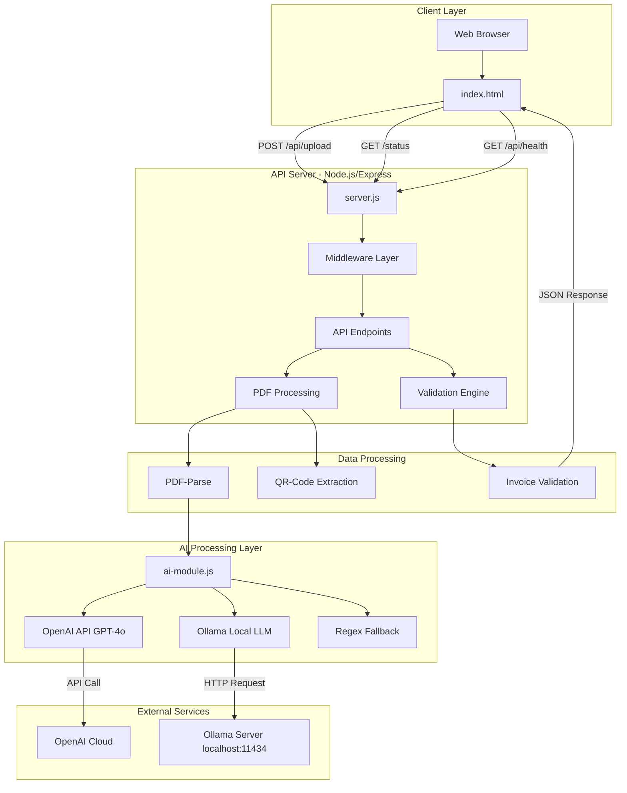

# Systemarchitektur - Rechnungsprüfer CHF v1.4.0

## Übersicht

Das System ist eine **Node.js/Express REST API** mit **Hybrid-KI-System** zur automatisierten Rechnungsprüfung von PDF-Dokumenten in Schweizer Franken (CHF).

---

## Systemkomponentensicht



---

## Komponenten im Detail

### 1. **Client Layer**

#### `public/index.html`
- **Typ**: Single-Page HTML5 Frontend
- **Funktionen**:
  - PDF-Upload mit Drag & Drop
  - Fortschrittsanzeige
  - Ergebnisdarstellung (Tabelle)
  - PDF-Vorschau (Base64 Embed)
  - Validierungsstatus mit Badges
- **Technologien**: HTML5, CSS3, Vanilla JavaScript
- **API-Kommunikation**: XMLHttpRequest (XHR)

---

### 2. **API Server (server.js)**

#### Middleware Stack
1. **CORS** - Cross-Origin Resource Sharing
2. **Body-Parser** - JSON & URL-encoded (50MB Limit)
3. **Express.static** - Statische Dateien aus `/public`
4. **Multer** - Multipart/Form-Data für PDF-Upload

#### API Endpoints

| Endpoint | Methode | Beschreibung |
|----------|---------|--------------|
| `/api/upload` | POST | PDF-Upload, Parsing, Validierung |
| `/api/validate` | POST | Manuelle JSON-Rechnungsprüfung |
| `/api/health` | GET | HTML Health-Check Seite |
| `/api/status` | GET | JSON Status-API mit Uptime |
| `/status` | GET | HTML Status-Dashboard |

#### Core Functions

**PDF Processing:**
```javascript
parseInvoiceWithAI(pdfText) → Invoice Object
extractQRCodeFromText(text) → QR String
parseInvoiceText(text) → Invoice Object (Regex Fallback)
```

**Validation:**
```javascript
validateInvoice(invoice) → { errors, warnings, checks, isValid }
```

**Validierungsregeln:**
- ✓ Rechnungsnummer vorhanden
- ✓ Datum vorhanden
- ✓ Summe Netto + MwSt = Brutto
- ✓ MwSt-Satz Berechnung (%)
- ✓ Logische Konsistenz (Netto < Brutto)

---

### 3. **AI Processing Layer (ai-module.js)**

#### Hybrid-KI-Strategie

Das System verwendet eine **3-stufige Fallback-Hierarchie**:

```
1. OpenAI GPT-4o (Cloud)
   ↓ (Fehler/Timeout)
2. Ollama Mistral (Lokal, Apple Silicon GPU)
   ↓ (Nicht verfügbar)
3. Regex Pattern Matching (Immer verfügbar)
```

#### Komponenten

**OpenAI Integration:**
- **Modell**: GPT-4o
- **Timeout**: 25 Sekunden
- **Funktion**: `parseInvoiceHybrid(pdfText)`
- **Prompt**: Strukturierte JSON-Extraktion mit Schema

**Ollama Integration:**
- **Modell**: Mistral 7B
- **Server**: `localhost:11434`
- **Hardware**: Apple Silicon GPU Optimization
- **Funktion**: `callOllama(prompt, model)`

**Regex Fallback:**
- **Patterns**: 
  - Rechnungsnummer: `/Rechnungs?nr\.?.*?([A-Z0-9-\/]+)/i`
  - Datum: `/(\d{1,2}[./-]\d{1,2}[./-]\d{4})/`
  - Beträge: `/\d+[.,]\d{2}/g`
- **Funktion**: `parseInvoiceText(text)`

#### AI Status Monitoring
```javascript
getAIStatus() → {
  openai: 'Verfügbar (Cloud)' | 'Nicht verfügbar',
  ollama: 'Verfügbar (Apple Silicon lokal)' | 'Nicht verfügbar',
  fallback: 'Regex (immer verfügbar)',
  activeMode: 'OpenAI (primär)' | 'Ollama' | 'Regex'
}
```

---

### 4. **Data Processing Components**

#### PDF-Parse
- **Library**: `pdf-parse` npm package
- **Input**: Buffer (req.file.buffer)
- **Output**: { text: string, numpages: number, ... }
- **Encoding**: Base64 für Preview

#### QR-Code Extraction
- **Patterns**:
  - SPC (Swiss Payment Code): `/SPC\/[\dA-Za-z\s\/\.\-,\n]*/g`
  - IBAN: `/CH\d{2}\s?[\dA-Z]{1,30}/g`
  - URLs: `/https?:\/\/[^\s]+/gi`
- **Parsing**: `parseQRCodeWithAI()` via Hybrid-System

#### Invoice Validation Engine
- **Input**: Invoice Object
- **Output**: Validation Object
  ```javascript
  {
    errors: string[],      // Kritische Fehler
    warnings: string[],    // Warnungen
    checks: Check[],       // Erfolgreich geprüfte Felder
    isValid: boolean       // Gesamtstatus
  }
  ```

---

## Datenfluss

### PDF-Upload Flow

```
1. User wählt PDF → FormData
   ↓
2. XHR POST /api/upload → Multer Middleware
   ↓
3. PDF Buffer → pdf-parse → Text Extraktion
   ↓
4. Text → AI-Module (Hybrid Processing)
   ↓
5. OpenAI API Call (25s Timeout)
   → Erfolg: Invoice JSON
   → Fehler: Ollama Fallback
      → Fehler: Regex Fallback
   ↓
6. Invoice Object → validateInvoice()
   ↓
7. JSON Response → Client
   {
     success: true,
     filename: string,
     pdfBase64: string,
     invoice: {...},
     validation: {...}
   }
   ↓
8. Client rendert Ergebnis-Tabelle + PDF Preview
```

---

## Deployment-Architektur

### Lokale Entwicklung
```
macOS (Apple Silicon)
├── Node.js Server :3000
├── Ollama Server :11434 (optional)
└── OpenAI API (Cloud)
```

### Production (Render.com)
```
Render.com Cloud
├── Node.js Container
│   ├── Build: npm install
│   ├── Start: node server.js
│   └── Port: 3000
├── Environment Variables
│   ├── NODE_ENV=production
│   └── OPENAI_API_KEY=sk-...
└── GitHub Auto-Deploy (main branch)
```

**Hinweis:** Ollama ist in Production nicht verfügbar → Fallback zu OpenAI/Regex

---

## Technologie-Stack

| Layer | Technologie | Version |
|-------|-------------|---------|
| **Runtime** | Node.js | Latest |
| **Framework** | Express.js | ^4.21.2 |
| **AI (Cloud)** | OpenAI GPT-4o | API |
| **AI (Lokal)** | Ollama Mistral | 7B |
| **PDF** | pdf-parse | ^1.1.1 |
| **Upload** | Multer | ^1.4.5-lts.1 |
| **HTTP Client** | Native http module | - |
| **Frontend** | Vanilla JS | - |
| **Deployment** | Render.com | Free Tier |

---

## Sicherheit

### Schutzmaßnahmen
1. **API Key Protection**
   - `.env` in `.gitignore`
   - Environment Variables auf Render
   - Kein Hardcoding

2. **File Upload**
   - Nur PDF-MIME-Types
   - 50MB Limit
   - Memory Storage (keine Disk-Persistenz)

3. **CORS**
   - Alle Origins erlaubt (Development)
   - Production: Spezifische Domains empfohlen

4. **Validation**
   - Input-Sanitization
   - JSON Schema Validation
   - Error Handling

---

## Performance-Charakteristiken

| Metrik | Wert |
|--------|------|
| **Cold Start** | ~2-3 Sekunden |
| **OpenAI Request** | 3-10 Sekunden |
| **Ollama Request** | 5-15 Sekunden |
| **Regex Fallback** | <100ms |
| **PDF Parsing** | 200-500ms |
| **Total (OpenAI)** | 5-15 Sekunden |
| **Total (Regex)** | 1-2 Sekunden |

---

## Monitoring & Observability

### Health Checks
- **GET /api/health** - HTML Status Page
- **GET /api/status** - JSON Status API
- **GET /status** - Dashboard mit Auto-Refresh (30s)

### Metriken
- Uptime (Sekunden)
- AI Module Status (OpenAI, Ollama, Fallback)
- Aktiver Modus
- Version
- Environment

### Logging
- Console Logs mit Emojis (🚀✅⚠️❌)
- Request/Response Logging
- AI Module Selection Logging

---

## Erweiterungsmöglichkeiten

### Geplante Features
1. **Datenbank** - PostgreSQL für Rechnungshistorie
2. **User Authentication** - JWT-basiert
3. **Batch Processing** - Mehrere PDFs gleichzeitig
4. **Export** - CSV/Excel Export
5. **Webhooks** - Integration mit externen Systemen
6. **OCR** - Für gescannte PDFs
7. **Template Matching** - Lieferanten-spezifische Parser

### Skalierung
- **Horizontal**: Render Auto-Scaling
- **Caching**: Redis für häufige Anfragen
- **Queue**: Bull/BullMQ für asynchrone Verarbeitung
- **CDN**: Cloudflare für statische Assets

---

## Version History

| Version | Datum | Features |
|---------|-------|----------|
| **1.4.0** | 27.12.2025 | Hybrid-KI, Status-Pages, Render-Deployment |
| **1.0.x** | Früher | Basis-Implementierung |

---

**Letzte Aktualisierung**: 27. Dezember 2025  
**Maintainer**: David Gianini  
**Repository**: https://github.com/mistergi-10/rechnungspruefung
